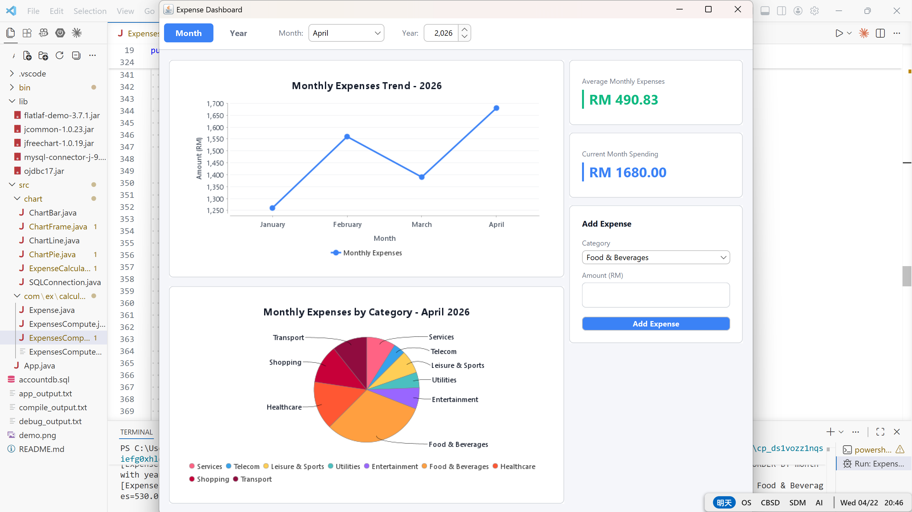

## Account Dashboard
Account Dashboard is a Java application that combines JavaBeans, Swing, and MySQL to manage and visualize expense data. At its core is a non‑visual JavaBean (ExpensesCompute) that handles financial computations and persistence. The system uses a Singleton SQLConnection for database access and external chart libraries (JFreeChart/XChart) to generate clear, labeled graphs of spending trends.

## Features
- ExpensesCompute Bean
    - Non-visual JavaBean following standard conventions
    - Implements Serializable for persistence
    - Provides methods for yearly totals, monthly totals, category totals, averages, comparisons, and percentage changes

- Database Integration
    - MySQL schema with fields: year, month, category, amount
    - Singleton SQLConnection ensures only one connection instance

- Charts & Visualization
    - Line, bar, and pie charts generated using JFreeChart/XChart
    - Includes chart titles, X/Y axis labels, and legends

- Design Patterns
    - Singleton for database connection
    - JavaBean for computation logic

## Demo

Run demo with `java -jar AccountDashboard-<version>.jar` (or double‑click it). Requires Java 8 or newer.

## Sequence Diagram

## Submission
Submission Material in ONE zipped folder, which label with your MATRIX No.: 
1. Sequence diagram 
2. Program codes & execution files (*.jar) – zipped project folder 
3. Export MySQL Database Schema (structure & data) 
4. Screenshot of graphs 

## References
1. Singleton Design Pattern, Retrieved from 
https://sourcemaking.com/design_patterns/singleton, March 2015 
2. JFreeChart1.5.6, Retrieved from http://www.jfree.org/jfreechart/ 
3. XChart, Retrieved from https://knowm.org/open-source/xchart/

