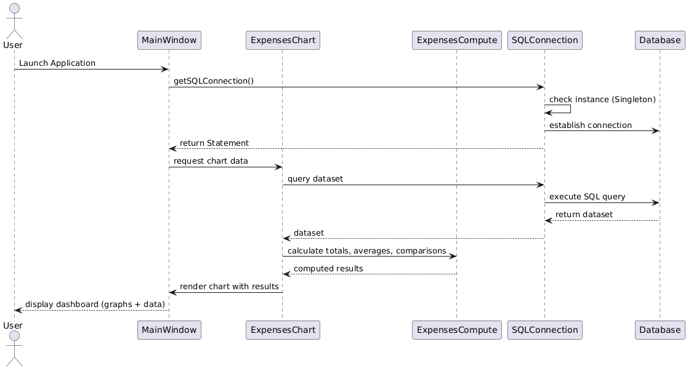
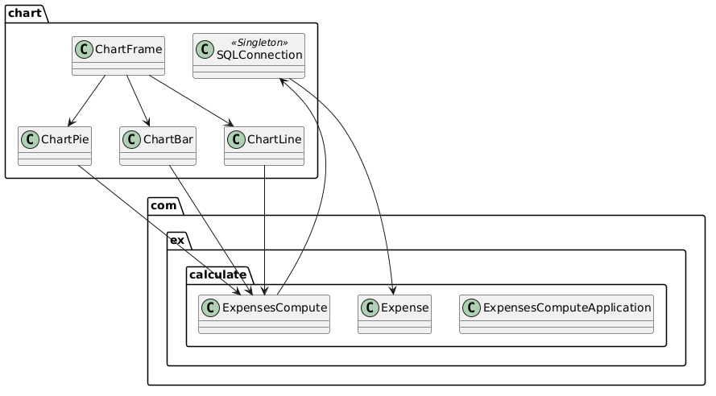

## Account Dashboard
A Java-based financial dashboard application that uses JavaBeans, Singleton design pattern, MySQL database, and chart libraries (JFreeChart/XChart) to compute and visualize expense data.

## Features
- ExpensesCompute Bean
    - Non-visual JavaBean following standard conventions
    - Implements Serializable for persistence
    - Provides methods for yearly totals, monthly totals, category totals, averages, comparisons, and percentage changes

- Database Integration

MySQL schema with fields: year, month, category, amount

Singleton SQLConnection ensures only one connection instance

- Charts & Visualization

Line, bar, and pie charts generated using JFreeChart/XChart

Includes chart titles, X/Y axis labels, and legends

- Design Patterns

Singleton for database connection

JavaBean for computation logic

## Demo

## Sequence Diagram

## Package Structure

## Objectives
1. Develop a non-visual JavaBean following standard JavaBean conventions 
2. Implement persistence using Serializable interface 
3. Manage data using arrays or ArrayList 
4. Generate documentation using Javadoc and package the component 

## Instructions
develop a JavaBean named: com.ex.calculate.ExpensesCompute

The bean must: 
- Have a no-argument constructor 
- Implement the Serializable interface 
- Import necessary packages 
- Act as a non-visual component

## Required Methods
1. Yearly Total Expenses  → Sum of all expenses for the year 
Parameter: array of integers 
Return: integer 
Example: [100, 200, 300] → total = 600 
2. Monthly Total Expenses → Total expenses for January, February, etc. 
Parameter: array of integers 
Return: integer 
Example: [100, 200, 300] → total = 600 
3. Yearly Total by Category → Example: Total Food & Beverages in 2026 
Parameter: array of integers 
Return: integer 
Example: [100, 200, 300] → total = 600 
4. Average Monthly Expenses → Total yearly / number of months 
Parameter: integer, integer 
Return: double 
Example: [1000, 4] → average monthly = 250 
5. Month-to-Month Comparison 
→ Difference between January and February 
→ (Increase / Decrease) 
6. Percentage Change Between Months 
→ ((Feb – Jan) / Jan) × 100 

## Submission
Submission Material in ONE zipped folder, which label with your MATRIX No.: 
1. Sequence diagram 
2. Program codes & execution files (*.jar) – zipped project folder 
3. Export MySQL Database Schema (structure & data) 
4. Screenshot of graphs 

## References
1. Singleton Design Pattern, Retrieved from 
https://sourcemaking.com/design_patterns/singleton, March 2015 
2. JFreeChart1.5.6, Retrieved from http://www.jfree.org/jfreechart/ 
3. XChart, Retrieved from https://knowm.org/open-source/xchart/

